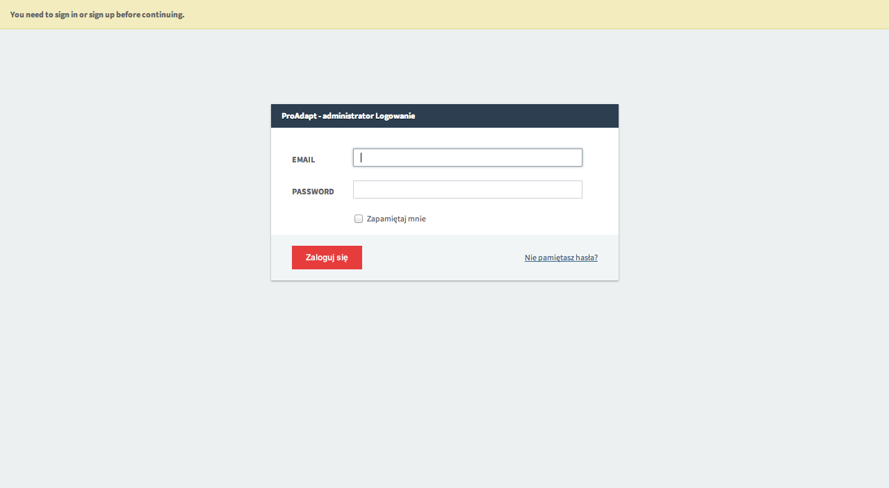
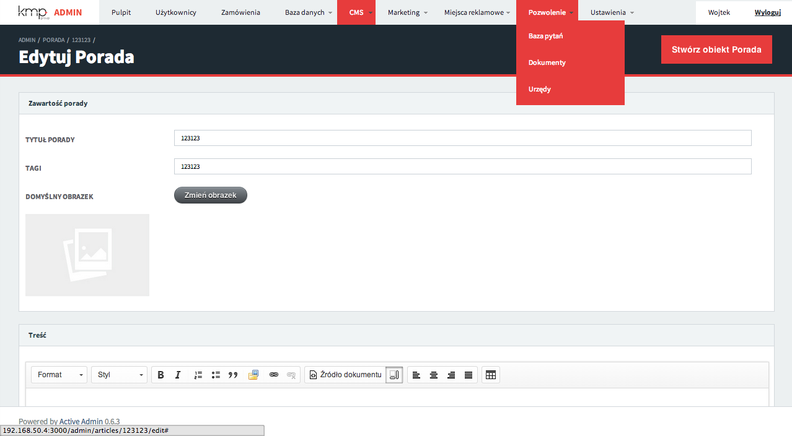
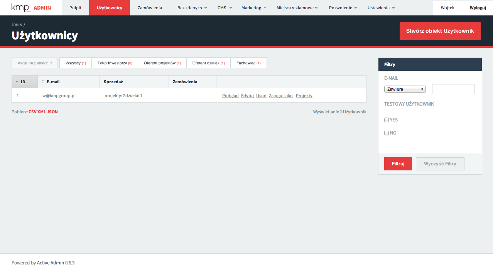
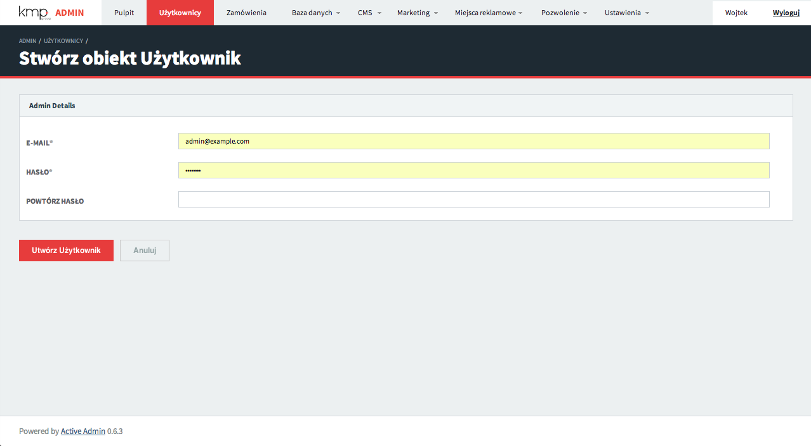
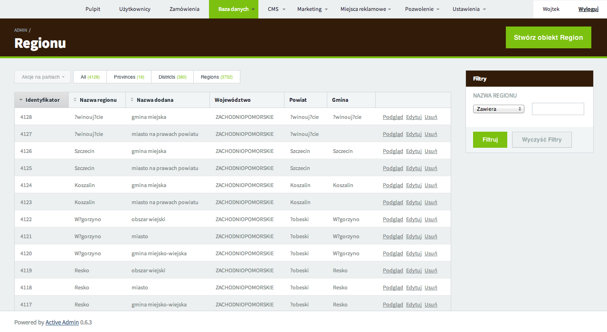
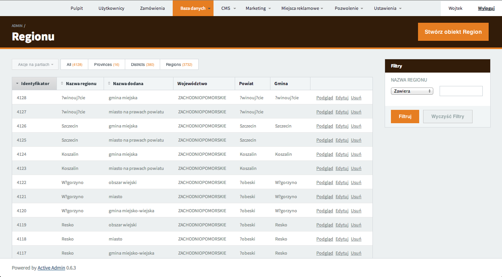
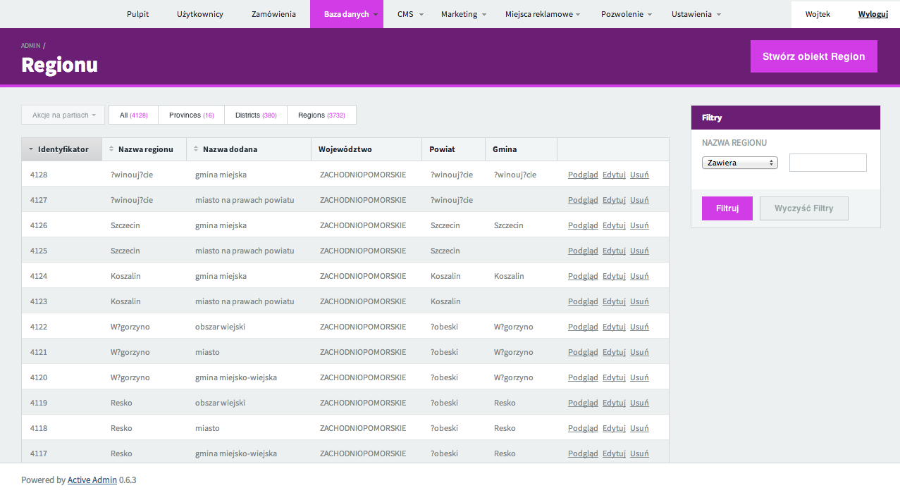
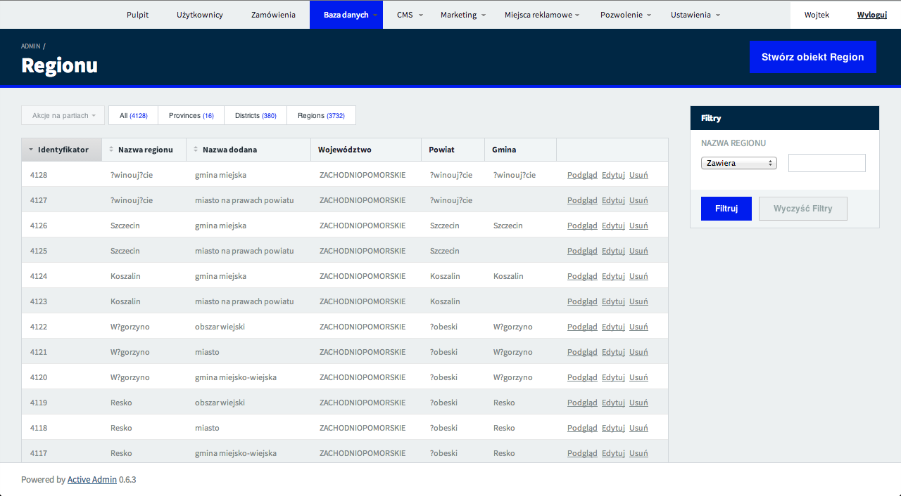

# ActiveSkin

Flat skin for active admin.

## Screens

<table>
  <tr>
    <td>
      
    </td>
    <td>
      
    </td>
  </tr>
  <tr>
    <td>
      
    </td>
    <td>
      
    </td>
  </tr>
</table>

## Installation

As active_skin is the css theme for the [active_admin](https://github.com/gregbell/active_admin) administration framework - you have to install if first.

Having active admin installed add the following line to your application's Gemfile:

    gem 'active_skin'

## Usage

include active skin css

    # active_admin.css.scss

    @import "active_admin/mixins";
    @import "active_admin/base";
    ...
    @import "active_skin";
    ...

Change logo by setting the `$skinLogo` variable above active_skin import line in active_admin.css.scss

    $skinLogo: url("admin_logo.png") no-repeat 0 0;

You can even change basic colors of the theme by placing some other variables:

    ...
    $skinActiveColor: #001cee;
    $skinHeaderBck: #002744;
    $panelHeaderBck: #002744;

    @import "active_skin";
    ...

### Color examples

<table>
  <tr>
    <td>
      
    </td>
    <td>
      
    </td>
  </tr>
  <tr>
    <td>
      
    </td>
    <td>
      
    </td>
  </tr>
</table>

## Contributing

1. Fork it ( http://github.com/KMPgroup/active_skin/fork )
2. Create your feature branch (`git checkout -b my-new-feature`)
3. Commit your changes (`git commit -am 'Add some feature'`)
4. Push to the branch (`git push origin my-new-feature`)
5. Create new Pull Request

## License

active_skin is Copyright © 2018 SoftwareBrothers.co. It is free software, and may be redistributed under the terms specified in the [LICENSE](LICENSE.txt) file.

## About SoftwareBrothers.co

We are a software company who provides web and mobile development and UX/UI services, friendly team that helps clients from all over the world to transform their businesses and create astonishing products.

* We are available to [hire](https://softwarebrothers.co/contact).
* If you want to work for us - checkout the [career page](https://softwarebrothers.co/career).
